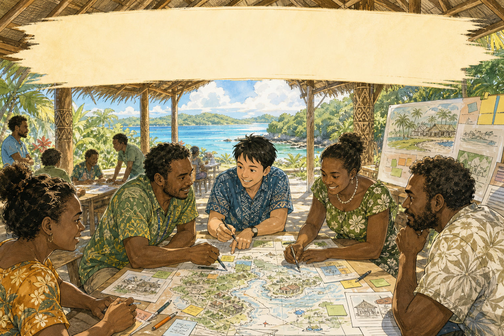
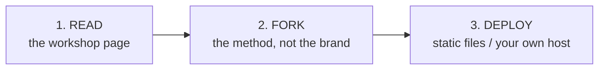
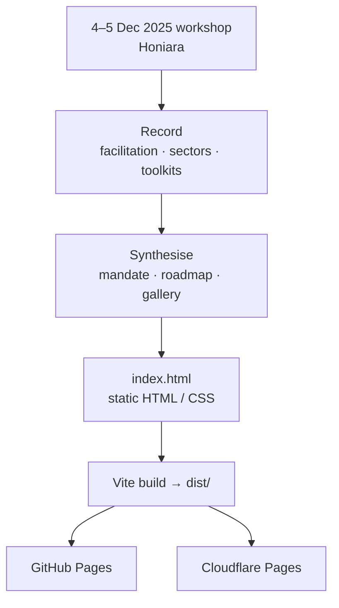

<p align="center">
  
</p>

<p align="center"><em>The cream brush-stroke band at the top is <strong>illustration only</strong>. It is part of the drawing, not a live title bar, not telemetry, and not a United Nations or Solomon Islands government product.</em></p>

# Digitalizing Solomon Islands

**Workshop report** — an independent civic-studio synthesis of the Honiara session on whole-of-government digital transformation, 4–5 December 2025.

**Live page:** [https://nonarkara.github.io/solomon-islands-workshop/](https://nonarkara.github.io/solomon-islands-workshop/)

Independent work by [Dr Non Arkaraprasertkul](https://github.com/Nonarkara) ([@Nonarkara](https://github.com/Nonarkara)). **Not a United Nations, UN DESA, or Government of Solomon Islands product** unless a file in this repository explicitly documents that relationship. This checkout does not contain such a file. See [Ethical use](#ethical-use).

---

## What this is

A static, low-bandwidth **document-in-code**: workshop facilitation outputs, sector discussion, and UNDESA toolkit synthesis kept as HTML and CSS rather than a PDF that sits in a drawer.

The page is titled *Digitalizing Solomon Islands | Strategic Workshop Report*. It is a public-facing record of a Honiara workshop on moving from fragmented digitalization toward whole-of-government transformation. The on-page eyebrow *UN DESA × Government of Solomon Islands* names the **workshop context**. It does not make this GitHub project an official UN or Solomon Islands Government publication.

What the page actually holds:

1. **Executive mandate** — transformation versus digitized paperwork; Once-Only service logic; national coordination with local inclusion
2. **Connectivity** — infrastructure reach, coverage figures discussed in the room, and challenge/opportunity pairs
3. **Sector priorities** — finance, health, justice, police/maritime, and foreign affairs
4. **UNDESA toolkits** — National E-Government Toolkit and Local Government Toolkit (LOSI), plus workshop quick wins
5. **Data governance and AI** — classification, sharing, and legislative items discussed in the room
6. **Institutions** — coordination architecture and human-centered change logic
7. **Three-phase roadmap** — foundation (0–12 months), integration (1–3 years), transformation (3+ years)
8. **Gallery** — curated Honiara workshop and place photographs
9. **Downloads** — agenda, concept note, and related files when present in the publish bundle

The HTML footer states the provenance directly: *Prepared from workshop facilitation outputs, sector discussions, and UNDESA toolkit synthesis. Honiara, Solomon Islands, December 2025.*

There is no application server, no database, and no API in this repo. Vite copies the static page into `dist/`. GitHub Pages and Cloudflare Pages serve that bundle from `main`.

---

## Philosophy

Five constraints. They are how this report is meant to be used, not slogans on a slide.

| Tenet | What it means here |
| --- | --- |
| **Transformation, not digitized paperwork** | The workshop drew a hard line: converting paper into screens is not the same as redesigning how the state serves people. Keep that line when you reuse the page. |
| **Once-Only, locally included** | National coordination is the point; provincial and island realities are the test. A Honiara-only digital story is the wrong shape. |
| **Document-in-code** | A report people will actually open on a weak connection. Static HTML and CSS. No JavaScript required to read. Stories and a roadmap before a 200-page annex. |
| **Honesty labels** | Workshop figures are workshop figures. Photographs are photographs. A drawing of a pavilion HUD is a drawing. Label the difference when you republish. |
| **Respect the room** | This page exists because Solomon Islands counterparts and partners sat together. Fork the method. Do not fork a logo and call it the state, the UN, or an endorsement. |



---

## Ethical use

This work sits in a civic-transparency practice: publish the synthesis, do not impersonate the institution.

**These are workshop materials.** Use them as a shareable record of the Honiara discussion, a teaching instrument, or a starting point for another island-state workshop you convene yourself.

**Respect local partners.** Photographs in `public/story-images/` show real people in a real room and a real place. Do not scrape faces into training sets, do not crop people into marketing that they did not agree to, and do not present the gallery as a government press kit. Keep captions modest. When you republish a figure or a story from the page, keep the provenance.

**This GitHub project is not a United Nations, UN DESA, or Government of Solomon Islands product** unless a file in this repository explicitly documents that relationship. Names, toolkit titles, Policy 8.1.7, and the on-page *UN DESA × Government of Solomon Islands* line describe workshop context and sources. They do not make this repository a UN organ, a Secretariat publication, or official Solomon Islands policy. Do not imply that endorsement.

### Measured vs modelled

Say which layer you are looking at. Do not dress illustration or workshop synthesis as a live national system.

| Surface | What it actually is |
| --- | --- |
| Manga banner (`docs/hero-banner.png`) | **Illustration only.** The cream brush-stroke band, the pavilion, the map, and the sticky notes are a civic-studio drawing — not a live title bar, not telemetry, not this page’s UI. |
| Connectivity metrics on the live page (towers, coverage, mobile penetration) | Figures **as synthesised on the workshop page**. They are not live counters computed by this repository. |
| Sector cards and the three-phase roadmap | Facilitation synthesis from the Honiara room. Not a gazetted national plan and not a UN DESA country programme. |
| UNDESA toolkit sections | Frameworks **referenced** in the workshop write-up. This repo does not ship those toolkits. |
| Workshop photographs (`public/story-images/`) | Photographs from Honiara, December 2025. People and place, not stock. |
| Agenda and concept note (`public/downloads/`) | Workshop materials committed in this tree. Treat them as session documents, not as an official UN or SIG record. |
| Other download links on the page (PDFs, PNG) | Listed in `index.html`. Large media is gitignored; those links work on the deployed site only when the files are in the publish bundle. |

**Do not:**

- Present this repo, the banner, or a fork as an official United Nations, UN DESA, or Government of Solomon Islands product.
- Treat illustrated, sample, or workshop-synthesised figures as measured national telemetry.
- Use the page as a live public-service system, an alert channel, or a substitute for official SIG or UN documents.
- Invent endorsements, co-authorship, or institutional seals that are not in this repository.
- Commit secrets. This tree has no `.env` and needs none for the report page.
- Strip provenance when you republish workshop stories, photographs, or figures.

The on-page technical note records that the page was built with Codex and manually edited by the workshop team. That is production history, not an institutional endorsement.

---

## How it works

Workshop material was recorded, synthesised, and turned into one static page. Vite builds it. GitHub Pages and Cloudflare Pages serve it.



What the tree actually contains:

| Path | Role |
| --- | --- |
| [`index.html`](index.html) | Full report: structure, copy, and styles |
| [`src/main.js`](src/main.js) | No-op stub. The page does not depend on client JavaScript to read |
| [`src/style.css`](src/style.css) | Alternate stylesheet in the Vite tree; the live report styles live in `index.html` |
| [`src/images.json`](src/images.json) | Filename list used by local photo-curation helpers |
| [`public/story-images/`](public/story-images/) | Curated gallery stills referenced by the page |
| [`public/downloads/`](public/downloads/) | Workshop agenda and concept note (DOCX) committed here |
| [`public/curation.html`](public/curation.html) | Local photo-curation preview. Not part of the public report |
| [`curate_photos.js`](curate_photos.js) / [`generate_curation_preview.cjs`](generate_curation_preview.cjs) | Local helpers. Not part of the public report |
| [`vite.config.js`](vite.config.js) | Vite config; `base: './'` for relative asset paths |
| [`.github/workflows/deploy.yml`](.github/workflows/deploy.yml) | GitHub Pages deploy from `main` |
| [`.github/workflows/cloudflare-pages.yml`](.github/workflows/cloudflare-pages.yml) | Cloudflare Pages deploy (`solomon-islands-workshop`) |
| [`docs/hero-banner.png`](docs/hero-banner.png) | README illustration |

Pushes to `main` trigger both deploy workflows. Large media (PDF, PNG, video, audio under `public/downloads/`) is gitignored and kept outside this repository; those resource links work on the deployed site when the files are present in the publish bundle.

---

## How to use materials

Use the page as a workshop record. Use the committed documents as session materials. Do not use either as a seal.

### View it

Open the live URL: [https://nonarkara.github.io/solomon-islands-workshop/](https://nonarkara.github.io/solomon-islands-workshop/).

### Workshop documents in this tree

| File | Use |
| --- | --- |
| [`public/downloads/Agenda_Solomon Isands_21102025_v2.docx`](public/downloads/Agenda_Solomon%20Isands_21102025_v2.docx) | Workshop agenda (filename spelling as committed) |
| [`public/downloads/2025 UNPSF Workshop _DGB_Concept Note_v.01.docx`](public/downloads/2025%20UNPSF%20Workshop%20_DGB_Concept%20Note_v.01.docx) | Concept note |

Cite them as workshop materials from this independent write-up. Do not relabel them as a UN or Solomon Islands Government publication unless you have a document — outside this README — that says so.

### Run locally

Requires Node.js 20+.

```bash
git clone https://github.com/Nonarkara/solomon-islands-workshop.git
cd solomon-islands-workshop
npm install
npm run dev
```

Then open the URL Vite prints (typically `http://localhost:5173`).

```bash
npm run build
npm run preview
```

builds a production bundle to `dist/` and serves it locally. You can also open the built `dist/index.html` as a file; a local server is more reliable for relative assets.

### Reuse

1. Fork [Nonarkara/solomon-islands-workshop](https://github.com/Nonarkara/solomon-islands-workshop) if you want another workshop page in this shape.
2. Keep the MIT notice.
3. Keep the honesty labels: workshop synthesis is not official policy; the banner HUD is illustration only; photographs are of people.
4. Do not copy UN, UN DESA, or Solomon Islands Government marks onto a fork as if they were yours.
5. If you add downloads, say what they are. Do not invent missing PDFs.

The page is intentionally lightweight for weak internet in distributed island contexts: static HTML/CSS, no JavaScript dependency for reading, compressed photos, mobile-first layout.

---

## License

This repository’s source is released under the [MIT License](LICENSE). Copyright (c) 2025–2026 Dr Non Arkaraprasertkul.

The MIT grant covers the code and page composition in this repo. Workshop photographs, UNDESA toolkit names, and linked government or UN documents remain subject to their original rights holders. The banner illustration in `docs/hero-banner.png` is studio artwork for this README; the cream HUD band is part of that artwork.

Fork the method. Keep the ethic. Do not pretend you are the United Nations or the Solomon Islands Government.
